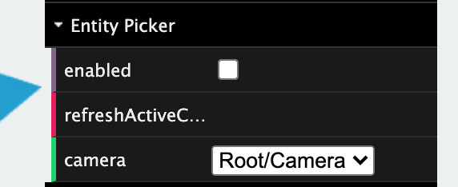

# How to add to a PlayCanvas App

The easiest way is to add a bookmarklet to the browser. It's the same as a bookmark but instead of a URL, you have executable JS code instead.

Create a bookmarklet by making a new bookmark and changing URL to the following:
```
javascript:(function(){var a=document.createElement('script');a.src='https://yaustar.github.io/playcanvas-devtools/injector.js';document.head.appendChild(a);})();
```

More detailed instructions on how to create a bookmarklet can be [found here](https://mreidsma.github.io/bookmarklets/installing.html).


# Available tools

## Mini Stats
Shows the CPU, GPU and total frame time in ms. Can be enabled/disabled via the menu.


## Physics debug renderer
Render physics volumes in the scene. Requires the script to be added to the scene first by clicking on `addPhysicsDebug`.


## Print scene graph
This will print out the scene hierarchy to the console to see the current state is. Really useful if you are adding/removing entities at runtime.


`entitiesOnly` will only print nodes that are entities (no meshInstances)
`enabledNodesOnly` will filter out disabled nodes from the print out
`printPaths` will print out the hierarchy paths of each node which makes it easier to modify the entity on the console

e.g.
```
var e = pc.app.root.findByPath('some/path/to/entity');
e.enabled = false;
```


`withFilter` allows you to add use the conditional in the filterString to print out where `node` represents the node to filter.

e.g.
Set the `filterString` to `node.model` will on print nodes with a model component.


## Entity picker
Allows you to middle click or touch on any object in the scene and print the details to the console. Useful for finding where entities are in the hierarchy and investigating the current prosperities on said entity. The hierarchy path is also printed to make easier to directly modify the entity on the console.

e.g.
```
var e = pc.app.root.findByPath('some/path/to/entity');
e.enabled = false;
```




The camera list should be set to camera that is used for the current view.

# Tool authors

* dataarts's dat.gui
* PlayCanvas Will's Debug physics renderer
* PlayCanvas Donovan's ministats
